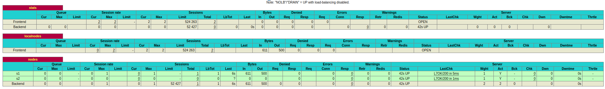

## AIT - Labo4

**Auteurs:** Barros Henriques Chris, Daubresse Gaëtan, Noël Éric

### Introduction 

### Install the tools

1. Screenshot de la stats page de HAProxy :  [http://192.168.42.42:1936](http://192.168.42.42:1936/) 

2. Liens de notre dépôt github https://github.com/kurisukun/Teaching-HEIGVD-AIT-2020-Labo-Docker

### Task 1: Add a process supervisor to run several processes

1. Screenshot de la stats page de HAProxy après avoir ajouté un superviseur : 

   

   On observe que le résultat est similaire au point précédent. 

2. Cette tâche a pour but de créer un superviseur dans les différents containers afin de pouvoir lancer plusieurs processus à l'intérieur de ceux-ci. 

   Les avantages d'utiliser un superviseur sont les suivants :  

   - Possibilité de redémarrer les services sans devoir redémarrer le conteneur. Cela offre donc un gain en matière de rapidité. 
   - Le process master a accès au flux de sortie et d'erreurs des différents processus, il a donc la possibilité d'enregistrer les logs de ceux-ci. 

   Nous n'avons pas rencontré de difficulté particulière pour la réalisation de cette tâche. 

### Task 2: Add a tool to manage membership in the web server cluster

> 1. Provide the docker log output for each of the containers: `ha`, `s1` and `s2`.

Les logs sont fournis dans ce [dossier](../logs/task2)

> 2. Give the answer to the question about the existing problem with the current solution.

Le problème existant avec cette solution est que tout le cluster repose sur ha, cela devient donc un single "point of failure". Il faudrait que chaque node puisse rejoindre le cluster de façon indépendante au lieu de le faire dépendre de ha. Si nous lançons s1 et s2 avant ha cela ne marchera pas. 

> 3. Give an explanation on how `Serf` is working. Read the official website to get more details about the `GOSSIP` protocol used in `Serf`. Try to find other solutions that can be used to solve similar situations where we need some auto-discovery mechanism.

"Serf is a tool for cluster membership, failure detection, and orchestration that is decentralized, fault-tolerant and highly available. Serf runs on every major platform: Linux, Mac OS X, and Windows. It is extremely lightweight: it uses 5 to 10 MB of resident memory and primarily communicates using infrequent UDP messages." [source](https://www.serf.io/intro/index.html)

Serf se base sur une liste de membres appartenant au cluster. Si cette liste change Serf permet l'exécution de script permettant  d'automatiser les tâches à réaliser si un service tombe. 

Serf détecte très rapidement s'il y a une erreur dans une des nodes et avertit ensuite le reste du cluster.  

Serf utilise un Gossip Protocol qui est basé sur le protocole SWIM. Ce protocole permet de propager un message en broadcast au cluster. Serf interroge périodiquement les nœuds, pour vérifier s'ils sont toujours actifs. Si ce n'est pas le cas, Serf définit ce nœud comme suspicious et propage cette information au reste du cluster. Le statut suspicious n'exclut pas encore le node du cluster. Si le nœud suspect ne contredit pas ce statut durant un intervalle de temps configurable, le nœud est considéré comme dead par serf qui propagera cette information au reste du cluster. 

