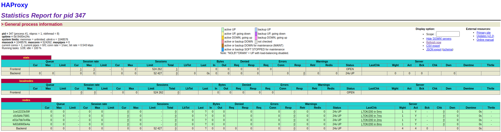

##  AIT - Labo4

**Auteurs:** Barros Henriques Chris, Daubresse Gaëtan, Noël Éric

[TOC]

### Introduction 

Dans ce laboratoire nous allons étudier la configuration de HAProxy ainsi que la manière d'implémenter un bon cluster. 

### Task 0: Identify issues and install the tools

#### Identify issues

> 1. **[M1]** Do you think we can use the current solution for a production environment? What are the main problems when deploying it in a production environment?

Non cette solution ne serait pas adaptée en production. Il y a un single point of failure au niveau du load balancer. Cela signifie que ci celui-ci crash le système ne sera plus opérationnel. De plus si une des nodes venaient à ne plus fonctionner, il faudrait la redémarrer manuellement.  

> 2. **[M2]** Describe what you need to do to add new `webapp` container to the infrastructure. Give the exact steps of what you have to do without modifiying the way the things are done. Hint: You probably have to modify some configuration and script files in a Docker image.

1. Pour ajouter un nouveau nœud à notre infrastructure nous devons modifier le fichier docker-compose.yml comme ceci. 

```
services :
  webapp3:
       container_name: ${WEBAPP_3_NAME}
       build:
         context: ./webapp
         dockerfile: Dockerfile
       networks:
         heig:
           ipv4_address: ${WEBAPP_3_IP}
       ports:
         - "4000:3000"
       environment:
            - TAG=${WEBAPP_3_NAME}
            - SERVER_IP=${WEBAPP_3_IP}
```

2. Nous devons également définir les variables d'environnement dans un fichier .env à la racine du projet. 

```
WEBAPP_3_NAME=s3
WEBAPP_3_IP=192.168.42.13
```

3. Pour terminer nous ajoutons la webapp3 au fichier de configuration `haproxy.cfg` de HAProxy. 

```
server s3 ${WEBAPP_3_IP}:3000 check
```


> 3. **[M3]** Based on your previous answers, you have detected some issues in the current solution. Now propose a better approach at a high level.

Une meilleure approche viserait à ajouter automatiquement au load balancer les nouvelles nodes qui sont démarrées. Il serait également intéressant d'avoir un système permettant de démarrer un nouveau lorsqu'il y en a qui tombe.  

> 4. **[M4]** You probably noticed that the list of web application nodes is hardcoded in the load balancer
>    configuration. How can we manage the web app nodes in a more dynamic fashion?

Nous pourrions utiliser un gossip protocol afin d'informer la présence des noeuds au load balancer. 

> 5. **[M5]** In the physical or virtual machines of a typical infrastructure we tend to have not only one main process (like the web server or the load balancer) running, but a few additional processes on the side to perform management tasks.
>
>    For example to monitor the distributed system as a whole it is common to collect in one centralized place all the logs produced by the different machines. Therefore we need a process running on each machine that will forward the logs to the central place. (We could also imagine a central tool that reaches out to each machine to gather the logs. That's a push vs. pull problem.) It is quite common to see a push mechanism used for this kind of task.
>
>    Do you think our current solution is able to run additional management processes beside the main web server / load balancer process in a container? If no, what is missing / required to reach the goal? If yes, how to proceed to run for example a log forwarding process?

En l'état non, il faudrait modifier les Dockerfile de manière à ce que pour chaque image, un superviseur associé soit lancé. Il sera également nécessaire de définir le protocole utilisé pour la communication entre les différents processus.  

> 6. **[M6]** In our current solution, although the load balancer configuration is changing dynamically, it doesn't follow dynamically the configuration of our distributed system when web servers are added or removed. If we take a closer look at the `run.sh` script, we see two calls to `sed` which will replace two lines in the `haproxy.cfg` configuration file just before we start `haproxy`. You clearly see that the configuration file has two lines and the script will replace these two lines.
>
>    What happens if we add more web server nodes? Do you think it is really dynamic? It's far away from being a dynamic configuration. Can you propose a solution to solve this?

Pour le moment si nous ajoutons une nouvelle node nous devrons ajouter manuellement des lignes aux fichiers de configurations comme décrit au point m2. Cela n'est pas une solution dynamique. 

Il faudrait utiliser un système de templating afin que les fichier de configuration soit généré automatiquement lors de l'ajout de nouvelles nodes. Nous pourrions par exemple utiliser `NodeJS` et  `Handlebars` comme moteur de template. 

#### Install the tools

1. Screenshot de la stats page de HAProxy :  [http://192.168.42.42:1936](http://192.168.42.42:1936/) 


2. Liens de notre dépôt github https://github.com/kurisukun/Teaching-HEIGVD-AIT-2020-Labo-Docker

### Task 1: Add a process supervisor to run several processes

1. Screenshot de la stats page de HAProxy après avoir ajouté un superviseur : 

   

   On observe que le résultat est similaire au point précédent. 

2. Cette tâche a pour but de créer un superviseur dans les différents containers afin de pouvoir lancer plusieurs processus à l'intérieur de ceux-ci. 

   Les avantages d'utiliser un superviseur sont les suivants :  

   - Possibilité de redémarrer les services sans devoir redémarrer le conteneur. Cela offre donc un gain en matière de rapidité. 
   - Le process master a accès au flux de sortie et d'erreurs des différents processus, il a donc la possibilité d'enregistrer les logs de ceux-ci. 

   Nous n'avons pas rencontré de difficulté particulière pour la réalisation de cette tâche. 

### Task 2: Add a tool to manage membership in the web server cluster

> 1. Provide the docker log output for each of the containers: `ha`, `s1` and `s2`.

Les logs sont fournis dans ce [dossier](../logs/task2)

> 2. Give the answer to the question about the existing problem with the current solution.

Le problème existant avec cette solution est que tout le cluster repose sur ha, cela devient donc un single "point of failure". Il faudrait que chaque node puisse rejoindre le cluster de façon indépendante au lieu de le faire dépendre de ha. Si nous lançons s1 et s2 avant ha cela ne marchera pas. 

> 3. Give an explanation on how `Serf` is working. Read the official website to get more details about the `GOSSIP` protocol used in `Serf`. Try to find other solutions that can be used to solve similar situations where we need some auto-discovery mechanism.

"Serf is a tool for cluster membership, failure detection, and orchestration that is decentralized, fault-tolerant and highly available. Serf runs on every major platform: Linux, Mac OS X, and Windows. It is extremely lightweight: it uses 5 to 10 MB of resident memory and primarily communicates using infrequent UDP messages." [source](https://www.serf.io/intro/index.html)

Serf se base sur une liste de membres appartenant au cluster. Si cette liste change Serf permet l'exécution de script permettant  d'automatiser les tâches à réaliser si un service tombe. 

Serf détecte très rapidement s'il y a une erreur dans une des nodes et avertit ensuite le reste du cluster.  

Serf utilise un Gossip Protocol qui est basé sur le protocole SWIM. Ce protocole permet de propager un message en broadcast au cluster. Serf interroge périodiquement les nœuds, pour vérifier s'ils sont toujours actifs. Si ce n'est pas le cas, Serf définit ce nœud comme suspicious et propage cette information au reste du cluster. Le statut suspicious n'exclut pas encore le node du cluster. Si le nœud suspect ne contredit pas ce statut durant un intervalle de temps configurable, le nœud est considéré comme dead par serf qui propagera cette information au reste du cluster. 

### Task 3: React to membership changes

> 1. Provide the docker log output for each of the containers:  `ha`, `s1` and `s2`.
>    Put your logs in the `logs` directory you created in the previous task.

Fournit dans le fichier log. 

> 2. Provide the logs from the `ha` container gathered directly from the `/var/log/serf.log`
>    file present in the container. Put the logs in the `logs` directory in your repo.

Fournit dans le fichier log. 

### Task 4: Use a template engine to easily generate configuration files

> 1. You probably noticed when we added `xz-utils`, we have to rebuild
>    the whole image which took some time. What can we do to mitigate
>    that? Take a look at the Docker documentation on
>    [image layers](https://docs.docker.com/engine/userguide/storagedriver/imagesandcontainers/#images-and-layers).

A chaque fois que docker exécute une commande, celui crée une nouvelle couche. Cette couche correspond à la différence dans le système de fichier avant et après l'exécution de cette commande. Chaque couche utilise de l'espace de stockage, il est donc important d'utiliser une seule est même commande lorsque nous travaillons dans le même fichier. 

Docker utilise un système de cache pour chacune des couches. Si nous effectuons un deuxième build et que les commandes précédentes n'ont pas changées docker utilisera le cache ce qui permettra de gagner du temps. Ceci implique que tous les composants qui ne changent pas souvent doivent être placé en début de fichier afin que le cache puisse être utilisé. Les composant changeant fréquemment seront placé de préférence en fin de fichier. 

squashing est une option permettant de, une fois le build terminé, stocker la différence entre chacune des couches dans une nouvelle couche.

flattening permet également de créer une seule est même couche pour une image docker qui en contient plusieurs. Pour cela nous utilisons la commande : `docker export <image> | docker import <resulting image` 

> 2. Propose a different approach to architecture our images to be able
>    to reuse as much as possible what we have done. Your proposition
>    should also try to avoid as much as possible repetitions between
>    your images.

Il faudrait mettre les commandes communes des dockerfile au début du fichier afin que le cache puisse être utilisé pour les deux images. Les commandes plus spécifiques seront placées en fin de fichier. 

> 3. Provide the `/tmp/haproxy.cfg` file generated in the `ha` container
>    after each step.  Place the output into the `logs` folder like you
>    already did for the Docker logs in the previous tasks. Three files
>    are expected.
>
>    In addition, provide a log file containing the output of the 
>    `docker ps` console and another file (per container) with
>    `docker inspect <container>`. Four files are expected.

Fournit dans le fichier log. 

> 4. Based on the three output files you have collected, what can you
>    say about the way we generate it? What is the problem if any?

Le problème vient du fait que chaque fois qu'un node se connecte au cluster, l'output indiquant sa connexion est écrasé au lieu d'être ajouté. C'est un problème car cela signifie que tout n'est pas loggé correctement et qu'il faudrait lancé manuellement chaque node individuellement et s'assurer à chaque fois qu'il s'est correctement connecté.

### Task 5: Generate a new load balancer configuration when membership changes

> 1. Provide the file `/usr/local/etc/haproxy/haproxy.cfg` generated in
>    the `ha` container after each step. Three files are expected.
>
>    In addition, provide a log file containing the output of the 
>    `docker ps` console and another file (per container) with
>    `docker inspect <container>`. Four files are expected.

Fournit dans le fichier logs. 

> 2. Provide the list of files from the `/nodes` folder inside the `ha` container.
>    One file expected with the command output.

Fournit dans le fichier logs 

> 3. Provide the configuration file after you stopped one container and
>    the list of nodes present in the `/nodes` folder. One file expected
>    with the command output. Two files are expected.
>
>    In addition, provide a log file containing the output of the 
>    `docker ps` console. One file expected.

Fournit dans le fichier logs 

### Task 6: Make the load balancer automatically reload the new configuration

> 1. Take a screenshots of the HAProxy stat page showing more than 2 web
>    applications running. Additional screenshots are welcome to see a
>    sequence of experimentations like shutting down a node and starting
>    more nodes.

Au début nous démarrons 4 nodes en plus de ha backend. 



Nous supprimons ensuite s3 et s4. 


Nous démarrons ensuite une nouvelle node s5. 


> Also provide the output of `docker ps` in a log file. At least 
> one file is expected. You can provide one output per step of your
> experimentation according to your screenshots.

Fournit dans le fichier logs. 


> 2. Give your own feelings about the final solution. Propose
>    improvements or ways to do the things differently. If any, provide
>    references to your readings for the improvements.

La solution finale remplit les objectifs voulu. Nous pourrions essayer de la rendre plus performante en réduisant le temps nécessaire à HAProxy pour reconnaître les nouvelles nodes. 

### Difficultés rencontrées 

Durant ce laboratoire la configuration était particulièrement lourde et nous n'avons pas toujours compris tout de suite le but des manipulations. 

### Conclusion 

Nous avons trouvé ce laboratoire intéressant car cela nous a appris à configurer un proxy de façon dynamique. Nous avons pu nous familiariser avec des gossip protocol tel que Serf permettant de rapidement détecter une erreur dans le réseau. Nous avons également pu consolider nos connaissances concernant HAProxy. 

